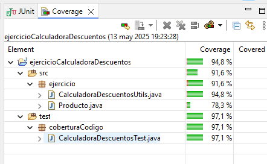

# Ejercicio JUnit

## Cobertura total del código


---

## Métodos empleados

#### 1. testMuchosProductosElectronicaVIP()
Comprobamos el funcionamiento del método ```calcularTotalConDescuento()``` pasándole como parámetros una lista de Productos con la categoría *"electronica"* y de cantidad superior a 5, y el booleano ```true```para indicar que es cliente VIP.
#### 2. testPocosProductosElectronicaSinVIP()
Comprobamos el funcionamiento del método ```calcularTotalConDescuento()``` pasándole como parámetros una lista de Productos con la categoría *"electronica"* y de cantidad inferior a 5, y el booleano ```false```para indicar que no es cliente VIP.
#### 3. testProductosRopaVIP()
Comprobamos el funcionamiento del método ```calcularTotalConDescuento()``` pasándole como parámetros una lista de Productos con la categoría *"ropa"*, uno de ellos con cantidad inferor a 3 y otro superior, y el booleano ```true```para indicar que es cliente VIP.
#### 4. testProductosHogarSinVIP()
Comprobamos el funcionamiento del método ```calcularTotalConDescuento()``` pasándole como parámetros una lista de Productos con la categoría *"hogar"*, uno de ellos con cantidad inferor a 2 y otro superior, y el booleano ```false```para indicar que no es cliente VIP.
#### 5. testProductosAlimentacionVIP()
Comprobamos el funcionamiento del método ```calcularTotalConDescuento()``` pasándole como parámetros una lista de Productos con la categoría *"alimentacion"*, y el booleano ```true```para indicar que es cliente VIP.
#### 6. testListaVacia()
Comprobamos el funcionamiento del método ```calcularTotalConDescuento()``` pasándole como parámetros una lista de Productos vacía, y el booleano ```true```para indicar que es cliente VIP.
#### 7. testCategoriaNoValida()
Comprobamos el funcionamiento del método ```calcularTotalConDescuento()``` al pasarle como parámetro una lista de Productos con una categoría no válida, de manera que lance una excepción ```IllegalArgumentException```.
